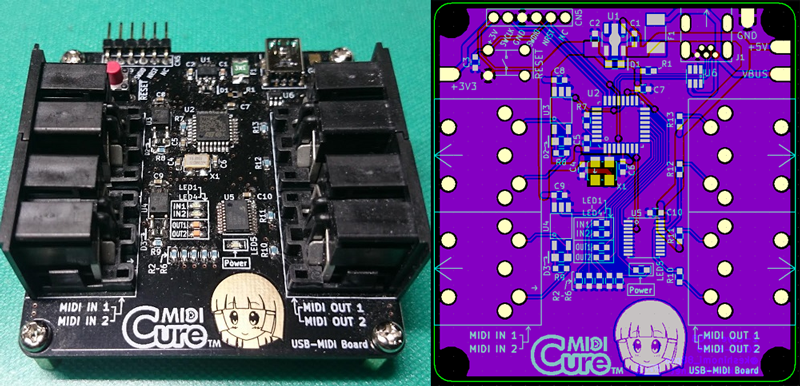

# USB-MIDI Interface (2IN/2OUT) for STM32 "CureMIDI"

## Overview

This repository shows STM32F0 (ARM Cortex-M0) based USB-MIDI Interface.
It has 2 MIDI-IN and 2 MIDI-OUT, and is USB MIDI class compatible.

The USB-MIDI Class Driver is based on [mimuz-tuch](https://github.com/mimuz/mimuz-tuch) project (c) [D.F.Mac. @TripArts Music](https://github.com/tadfmac).

STM32F0を使用した、USB-MIDIインターフェースです。INを2系統、OUTを2系統実装してあります。USB MIDI Classに対応するシステムに対し、ドライバレスでMIDI入出力ポートを追加できます。

USB MIDI Classドライバは、[D.F.Mac. @TripArts Music](https://github.com/tadfmac)氏作成の[ドライバ](https://github.com/mimuz/mimuz-tuch/tree/master/STM32)を基に、一部改造を加えています。

## Specifications

* USB MIDI class compatible
* MIDI port: 2IN/2OUT
* MIDI buffer size: 512B/1port

## Building Information

### Making hardware

See [Schematic](./hardware/schematic.pdf).

### Building software

Install [SW4STM32](http://www.openstm32.org/HomePage)(need registration), import [Project files](./software/SW4STM32_project/), and build.

## File Location

* [Binary file for STM32F042](./software/bin/)
* [STM32CubeMX Project file](./software/SW4STM32_project/CureMIDI_IF.ioc)
* [Source codes and project files (System WorkBench for STM32)](./software/SW4STM32_project/)
* [Schematic](./hardware/schematic.pdf)

## References

### MIDI specification

* [The Complete MIDI 1.0 Detailed Specification](https://www.midi.org/specifications/item/the-midi-1-0-specification) ([MIDI Association](https://www.midi.org/))
* [MIDI1.0規格書](http://amei.or.jp/midistandardcommittee/MIDI1.0.pdf) ([AMEI](http://amei.or.jp/))
* [MIDIの学習](http://www1.plala.or.jp/yuuto/midi/index.html) ([Laboratory "U"](http://www1.plala.or.jp/yuuto/top.html))

### USB-MIDI technical information

* [Universal Serial Bus Device Class Definition for MIDI Devices](http://www.usb.org/developers/docs/devclass_docs/midi10.pdf)
* [USBおよびUSB MIDIについて調べる](http://picmidi.seesaa.net/article/150728556.html) ([PICでMIDI！](http://picmidi.seesaa.net/))

## Copyrights

* USB MIDI Class Driver by [D.F.Mac. @TripArts Music](http://ta-music.strikingly.com/)
* STM32 CubeF0 by [STMicroelectronics](https://www.st.com/en/embedded-software/stm32cubef0.html)

## Author

(c) 2018 Keshikan ( [Website](http://www.keshikan.net/),  [Twitter](https://twitter.com/keshinomi_88pro) )

## License

* USB MIDI Class Driver: [CC BY 4.0](https://creativecommons.org/licenses/by/4.0/)
* STM32 CubeF0: BSD-3-Clause based.
* Other Codes, Hardware, Schematic: [GPLv3](https://www.gnu.org/licenses/gpl-3.0.html)

See also [LICENSE.md](./LICENSE.md)